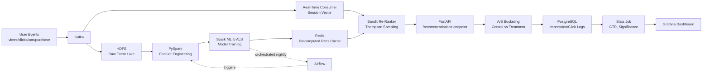

# Product Recommendation System Using User Behavioural Data
### Project Execution Plan — Team of Two

---

## 1. The Goal We Want to Reach

Build a **production-style product recommendation engine** for an e-commerce-style platform that:

- Predicts what a user is likely to engage with next, based on **implicit behavioural signals** (views, clicks, cart-adds, purchases) — not explicit ratings.
- Runs as a **real system**, not a notebook: distributed storage → distributed processing → trained model → cached serving layer → live API.
- Adapts **within a session** using real-time re-ranking, not just nightly batch updates.
- Proves its own value through an **A/B testing framework** that measures lift over a non-personalized baseline.
- Is **deployable end-to-end**, so it can be demoed live (API + optional UI) — not just described on paper.

**End state:** A user hits an endpoint (or UI), gets personalized top-N product recommendations in under 50ms, recommendations shift as they interact with the session, and we have dashboard-backed proof that personalization beats popularity-based ranking.

---

## 2. The Route Decided

We're going with a **Lambda-style architecture** — batch layer for heavy model training + real-time layer for session adaptation. This is deliberate: it's the same pattern used by real recommendation systems (Amazon, Flipkart, Netflix), and it lets two people work in parallel without blocking each other.

### High-Level Flow



### Why this route
- **Batch (ALS via Spark)** gives us accurate, scalable collaborative filtering — the core intelligence.
- **Real-time layer (Kafka + bandit)** stops the system from feeling "stale" mid-session — a strong differentiator most fresher projects skip entirely.
- **A/B testing** turns this from "we built a model" into "we proved the model works" — this is the single biggest credibility signal for a recruiter.
- **Clean separation of Data/ML vs Systems/Serving** means two people can build simultaneously against one shared contract (the event schema) instead of working sequentially.

---

## 3. Requirements

### 3.1 Technical Stack

| Layer | Technology | Notes |
|---|---|---|
| Ingestion | Apache Kafka | Local single-broker setup is enough |
| Data Lake | HDFS (pseudo-distributed) | Or MinIO/local FS if HDFS setup gets heavy |
| Processing | PySpark | Run locally in standalone mode, no cluster needed |
| Modeling | Spark MLlib (ALS) + scikit-learn (TF-IDF) | ALS for CF, TF-IDF for content-based fallback |
| Orchestration | Apache Airflow | Local Docker-based install |
| Serving Cache | Redis | Docker container, trivial to set up |
| API | FastAPI | Python, async-friendly |
| Metadata/Logs | PostgreSQL | Users, items, A/B logs |
| Monitoring | Prometheus + Grafana | Docker Compose stack |
| Frontend (optional) | React | Only if time permits — API-first is priority |
| Containerization | Docker + Docker Compose | Mandatory — this is how you deploy fast and keep environments identical for both of you |

### 3.2 Data Requirements
- A public implicit-feedback dataset to bootstrap: **Instacart Market Basket dataset**, **RetailRocket dataset**, or **Amazon Reviews (2023) implicit subset**.
- Minimum fields needed: `user_id, item_id, event_type, timestamp` — agree on this schema **before writing any code**.
- Item metadata (category, description) needed for the TF-IDF content-based fallback.

### 3.3 Skill/Setup Requirements
- Both: Python 3.10+, Docker, Git (shared repo, branch-per-feature workflow)
- You (Data/ML): PySpark basics, Spark MLlib ALS, basic bandit algorithms
- Friend (Systems): FastAPI, Redis client, Airflow DAG authoring, Prometheus/Grafana config
- Shared: one `docker-compose.yml` that spins up Kafka, Redis, Postgres, Airflow — so neither of you fights local environment issues

### 3.4 Infra/Cost Requirements
- Everything above runs **free, locally, via Docker** — no cloud spend needed for development.
- Optional final deployment: a single free-tier cloud VM (Oracle Cloud free tier / AWS free tier EC2) just to host the demo for recruiters — not required during build.

---

## 4. Task Distribution (User-Wise)

### Your Tasks — Data + ML Track
- [ ] Define and document the event schema (`user_id, item_id, event_type, timestamp`)
- [ ] Set up Kafka producer to simulate/ingest user events
- [ ] Set up HDFS (or local data lake equivalent) for raw event storage
- [ ] Write PySpark job: clean data, build user-item interaction matrix with weighted implicit signals (purchase=5, cart=3, click=1)
- [ ] Train ALS collaborative filtering model (Spark MLlib)
- [ ] Build content-based fallback model (TF-IDF + cosine similarity) for cold-start users/items
- [ ] Run offline evaluation: Precision@K, Recall@K, coverage
- [ ] Build real-time session-vector consumer (reads Kafka live events)
- [ ] Implement multi-armed bandit re-ranker (Thompson Sampling) on top of cached candidates
- [ ] Push trained model outputs + precomputed top-N recs into Redis (handoff point to Friend's serving layer)

### Friend's Tasks — Systems + Serving Track
- [ ] Set up Docker Compose stack (Kafka, Redis, Postgres, Airflow)
- [ ] Build Airflow DAG: ingestion → feature engineering → training → cache refresh, scheduled nightly
- [ ] Build FastAPI service with `/recommendations/{user_id}` endpoint, reading from Redis
- [ ] Integrate the real-time re-ranker output into the serving endpoint (consumes Your bandit output)
- [ ] Build A/B bucketing logic (deterministic hash of `user_id`) — control vs treatment
- [ ] Log impressions, clicks, conversions per group to PostgreSQL
- [ ] Build scheduled stats job: CTR, conversion rate, significance test (chi-squared/t-test)
- [ ] Set up Prometheus metrics + Grafana dashboards (latency, cache hit rate, A/B results)
- [ ] (Optional, time permitting) Build a minimal React UI to demo live recommendations
- [ ] Write API documentation (OpenAPI/Swagger, auto-generated by FastAPI — just clean it up)

**Shared/Joint Tasks**
- [ ] Agree on and freeze the event schema (Day 1, before either of you starts coding)
- [ ] Integration testing each week (don't wait till the end)
- [ ] Final deployment to a demo VM
- [ ] README + architecture diagram + demo video/script for recruiters

---

## 5. Folder Structure

```
recommendation-system/
│
├── docker-compose.yml                 # Spins up every service together
├── docker-compose.prod.yml            # Production overrides (resource limits, etc.)
├── .env.example                       # Shared config template (ports, topic names, keys)
├── README.md
├── ARCHITECTURE.md                    # Diagram + explanation for recruiters
│
├── data/
│   ├── raw/                           # Local fallback if not using real HDFS
│   ├── sample/                        # Small sample dataset for local dev/testing
│   └── schema.json                    # THE event schema — source of truth
│
├── ingestion/
│   ├── kafka_producer.py              # Simulates/publishes user events
│   ├── hdfs_writer.py                 # Batch consumer → writes to HDFS as Parquet
│   ├── topics.py                      # Kafka topic name constants
│   └── requirements.txt
│
├── processing/
│   ├── spark_jobs/
│   │   ├── build_interaction_matrix.py
│   │   ├── train_als_model.py
│   │   ├── train_content_based.py
│   │   └── evaluate_model.py
│   ├── utils/
│   │   ├── spark_session.py           # Shared SparkSession config
│   │   └── weighting.py               # Implicit feedback weighting logic
│   └── requirements.txt
│
├── realtime/
│   ├── session_consumer.py            # Kafka consumer → builds live session vectors
│   ├── bandit.py                      # Thompson Sampling re-ranker
│   └── requirements.txt
│
├── orchestration/
│   └── airflow/
│       ├── dags/
│       │   └── nightly_retrain_dag.py
│       ├── Dockerfile
│       └── requirements.txt
│
├── serving/
│   ├── app/
│   │   ├── main.py                    # FastAPI entrypoint
│   │   ├── routes/
│   │   │   ├── recommendations.py
│   │   │   └── health.py
│   │   ├── services/
│   │   │   ├── redis_client.py
│   │   │   ├── ab_testing.py
│   │   │   └── ranker.py              # Calls into realtime/bandit.py
│   │   ├── models/
│   │   │   └── schemas.py             # Pydantic request/response models
│   │   └── config.py
│   ├── Dockerfile
│   └── requirements.txt
│
├── experimentation/
│   ├── bucketing.py                   # Deterministic hash-based A/B assignment
│   ├── logger.py                      # Writes impressions/clicks to PostgreSQL
│   ├── stats_job.py                   # CTR + significance testing, scheduled
│   └── requirements.txt
│
├── monitoring/
│   ├── prometheus/
│   │   └── prometheus.yml
│   └── grafana/
│       ├── dashboards/
│       │   └── recsys_dashboard.json
│       └── provisioning/
│
├── frontend/                          # Optional
│   ├── src/
│   ├── public/
│   └── package.json
│
├── infra/
│   ├── postgres/
│   │   └── init.sql                   # Table definitions
│   └── nginx/                         # Reverse proxy config (prod only)
│
├── notebooks/                         # Exploration only — never production code
│   ├── eda.ipynb
│   └── offline_eval_playground.ipynb
│
└── tests/
    ├── test_feature_engineering.py
    ├── test_bandit.py
    ├── test_api.py
    └── test_ab_bucketing.py
```

---

## 6. File / Folder Ownership

### Data + ML Track
| Path | Owner |
|---|---|
| `ingestion/kafka_producer.py`, `hdfs_writer.py`, `topics.py` | Data + ML |
| `processing/spark_jobs/` (build_interaction_matrix, train_als_model, train_content_based, evaluate_model) | Data + ML |
| `processing/utils/` (spark_session, weighting) | Data + ML |
| `realtime/session_consumer.py`, `bandit.py` | Data + ML |
| `data/schema.json` | Data + ML (jointly agreed) |
| `notebooks/` | Data + ML |
| `tests/test_feature_engineering.py`, `tests/test_bandit.py` | Data + ML |

### Systems + Serving Track
| Path | Owner |
|---|---|
| `orchestration/airflow/dags/nightly_retrain_dag.py` | Systems + Serving |
| `serving/app/` (main.py, routes/, services/, models/, config.py) | Systems + Serving |
| `experimentation/` (bucketing, logger, stats_job) | Systems + Serving |
| `monitoring/` (prometheus.yml, grafana dashboards) | Systems + Serving |
| `infra/postgres/init.sql` | Systems + Serving |
| `infra/nginx/` | Systems + Serving (deployment stage) |
| `frontend/` | Systems + Serving (optional) |
| `tests/test_api.py`, `tests/test_ab_bucketing.py` | Systems + Serving |

### Shared / Root
| Path | Notes |
|---|---|
| `docker-compose.yml`, `docker-compose.prod.yml` | Both — coordinate before editing |
| `.env.example` | Both — coordinate before editing |
| `README.md`, `ARCHITECTURE.md` | Both |

---

## 7. Phase-Wise Breakdown

### Phase 0 — Setup & Contract (2–3 days)
- Finalize dataset choice
- Finalize event schema
- Set up shared GitHub repo, branching strategy (`main`, `feature/*`)
- Both spin up the Docker Compose stack locally and confirm it works

### Phase 1 — Foundation (Week 1)
| You | Friend |
|---|---|
| Kafka producer + HDFS ingestion with sample data | Docker Compose stack finalized; Airflow skeleton DAG (empty tasks, just structure) |
| Explore dataset, plan feature engineering | FastAPI scaffold with a dummy `/recommendations/{user_id}` returning static data |

**Milestone:** Raw events flowing into Kafka/HDFS. Dummy API returns hardcoded response.

### Phase 2 — Core Pipeline (Week 2)
| You | Friend |
|---|---|
| PySpark feature engineering job (interaction matrix) | Redis integration — connect FastAPI to Redis, read/write test keys |
| Train first ALS model, sanity-check outputs | Airflow DAG wired to actually trigger the feature engineering + training jobs |

**Milestone:** ALS model produces real recommendations for a test user; Airflow can trigger the pipeline end-to-end (even if manually run).

### Phase 3 — Intelligence Layer (Week 3)
| You | Friend |
|---|---|
| Content-based fallback (TF-IDF) for cold-start | A/B bucketing logic + PostgreSQL logging schema |
| Offline evaluation: Precision@K, Recall@K, coverage | Stats job for CTR/conversion (can use dummy logged data for now) |

**Milestone:** Cold-start handled; A/B framework logs real bucketed traffic even if the "treatment" model is still just the base ALS output.

### Phase 4 — Real-Time Layer (Week 4)
| You | Friend |
|---|---|
| Real-time Kafka consumer building session vectors | Grafana dashboards (latency, cache hit rate) |
| Bandit re-ranker (Thompson Sampling) integrated with cached candidates | Wire A/B stats job output into Grafana; add Prometheus metrics to FastAPI |

**Milestone:** Recommendations visibly change within a session as a user clicks more items. Dashboard shows live latency + A/B numbers.

### Phase 5 — Integration, Polish & Deploy (Week 5)
- Both: end-to-end integration testing (does a fresh user get cold-start recs → then personalized recs → then re-ranked recs as they click?)
- Both: deploy full stack to a free-tier cloud VM using Docker Compose
- Both: write the README, architecture diagram, and a 2–3 min demo script/video
- Both: stress-test the API (basic load test — even just `locust` or `ab`) to be able to quote a real latency number

**Milestone:** Fully deployed, demoable system with a recorded walkthrough — ready to link on a resume/LinkedIn.

---

## 8. Tips & Tricks to Finish and Deploy ASAP

**Speed tricks**
- **Don't build your own dataset generator first** — use a real public dataset (RetailRocket/Instacart) from day one. Building fake data generators eats a week for zero payoff.
- **Skip a real HDFS cluster if it's eating time** — a single-node pseudo-distributed HDFS or even local Parquet files on disk demonstrates the same architectural concept for the write-up. Don't let infra setup block the ML work.
- **Build the "dumb" version first, then upgrade.** Week 1 dummy API returning static data → Week 2 real ALS output → Week 3 fallback → Week 4 real-time. Never wait for the "perfect" version before wiring the pipeline end-to-end.
- **Docker Compose everything.** One `docker-compose up` should bring up Kafka, Redis, Postgres, Airflow for both of you — kills the "works on my machine" problem entirely.

**Collaboration tricks**
- **Freeze the schema early and never change it silently.** Any schema change = a message to the other person first. This is the #1 way two-person data projects break.
- **Integrate weekly, not at the end.** Merge and run the full pipeline together every Friday, even if pieces are stubbed. Catching integration bugs early is 10x cheaper than at week 5.
- **Use a shared `.env` / config file** for ports, topic names, Redis keys — avoid hardcoding values that only exist in one person's local setup.

**Deployment tricks**
- **One free-tier VM is enough** (Oracle Cloud Free Tier gives a genuinely usable always-free instance) — don't overthink cloud infra, this isn't the point of the project.
- **Use `docker-compose.prod.yml`** with resource limits so the whole stack fits on a small VM (2 vCPU / 4GB RAM range).
- **Cache aggressively, compute lazily.** Precompute everything possible nightly (Airflow) so the live API is basically just Redis reads — this is *why* production recsys are fast, and mirroring it is the whole point.

**Recruiter-optics tricks**
- **Record a 2-minute demo video** (terminal + API calls + Grafana dashboard) and link it on your resume/GitHub — recruiters skim, they don't run your Docker Compose.
- **Quote real numbers** in your resume bullet: "Achieved 42ms p99 serving latency and 18% CTR lift over baseline (A/B tested, p<0.05)" hits far harder than "built a recommendation system."
- **Put the architecture diagram in your README** — this document's Mermaid diagram (Section 2) is ready to paste in as-is.

---

*This plan is designed for a 5-week build with two contributors working in parallel tracks (Data/ML and Systems/Serving), integrating weekly, and shipping a deployed, demoable, A/B-tested recommendation system.*